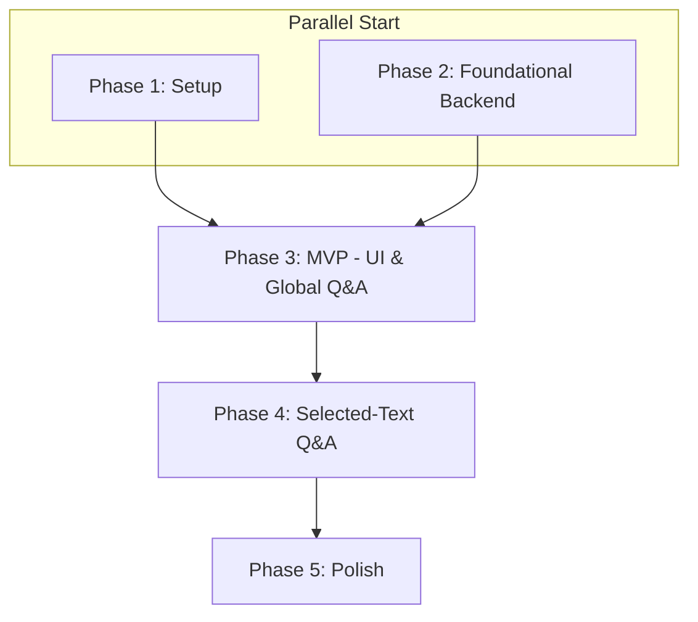

# Actionable Tasks: RAG Chatbot Integration

**Feature**: [Integrate RAG Agent with Frontend Chatbot](plan.md)
**Last Updated**: 2025-12-29

## Implementation Strategy

The implementation is phased to deliver a functional MVP first, followed by enhancements.

1.  **MVP (Phase 3)**: The primary goal is to get a working end-to-end flow with the core chatbot UI and the "Global Q&A" feature. This delivers immediate value and validates the integration.
2.  **Enhancement (Phase 4)**: The "Selected-Text Q&A" feature will be built on top of the working MVP.
3.  **Polish (Phase 5)**: Final touches to UI/UX and error handling will be done last.

---

## Phase 1: Environment Setup

**Goal**: Prepare the development environment and install all necessary dependencies.

-   [ ] T001 Add backend dependencies (`fastapi`, `uvicorn`, `python-dotenv`) to `backend/requirements.txt`
-   [ ] T002 Install or update backend dependencies by running `pip install -r backend/requirements.txt` in the `backend` directory
-   [ ] T003 Install frontend dependencies (`tailwindcss`, `postcss`, `autoprefixer`) by running `npm install -D tailwindcss postcss autoprefixer` in the root directory
-   [ ] T004 Initialize and configure Tailwind CSS by running `npx tailwindcss init` and updating `tailwind.config.js` and `src/css/custom.css`

---

## Phase 2: Foundational Backend

**Goal**: Create the skeleton for the FastAPI application and the chat endpoint.

-   [ ] T005 Create the main API file at `backend/chatbot_api.py`
-   [ ] T006 Set up the basic FastAPI app instance and router in `backend/chatbot_api.py`
-   [ ] T007 [P] Define Pydantic models for `ChatPayload` and `AgentResponse` in `backend/chatbot_api.py` based on `data-model.md`
-   [ ] T008 Implement the `POST /chat` endpoint skeleton in `backend/chatbot_api.py`
-   [ ] T009 In a main application entrypoint (e.g., `backend/main.py`), mount the router from `backend/chatbot_api.py`

---

## Phase 3: MVP - Chatbot UI & Global Q&A

**Goal**: Implement the core user-facing chatbot and connect it to the backend for global question-answering.
**User Stories**: US1 (Global Q&A), US3 (Chatbot UI).
**Independent Test**: The chatbot icon should be visible and toggle a chat window. Users can ask a question and receive a relevant answer from the book's content.

### Tasks

-   [ ] T010 [US1, US3] Create a new directory for the chatbot components at `src/components/Chatbot`
-   [ ] T011 [US1, US3] Swizzle the Docusaurus Root component by creating `src/theme/Root.js`
-   [ ] T012 [US1, US3] In `src/theme/Root.js`, import and wrap the original Root component to include the main Chatbot component, making it globally available
-   [ ] T013 [P] [US1, US3] Implement the floating icon and the main chat window toggle logic in a new `src/components/Chatbot/ChatContainer.js`
-   [ ] T014 [P] [US1, US3] Create the UI components for the chat interface: `ChatWindow.js`, `MessageList.js`, `Message.js`, and `ChatInput.js` in `src/components/Chatbot/`
-   [ ] T015 [US1] In `backend/chatbot_api.py`, implement the "Global RAG Mode" logic in the `/chat` endpoint by importing and calling the agent from `backend/agent.py`
-   [ ] T016 [US1, US3] In `src/components/Chatbot/ChatContainer.js`, implement the client-side `fetch` call to the `/chat` endpoint
-   [ ] T017 [US1, US3] Implement the state management in `src/components/Chatbot/ChatContainer.js` to handle conversation history and display the agent's response in the UI

---

## Phase 4: Feature Enhancement - Selected-Text Q&A

**Goal**: Enable users to ask questions about a specific piece of text they highlight.
**User Story**: US2.
**Independent Test**: When a user selects text, a button should appear. Clicking it and asking a question should yield an answer based only on that selected text.

### Tasks

-   [ ] T018 [P] [US2] Create a `FloatingActionButton` component in `src/components/Chatbot/FloatingActionButton.js`
-   [ ] T019 [US2] In the custom `src/theme/Root.js`, add a global `mouseup` event listener to detect text selection
-   [ ] T020 [US2] When text is selected, render the `FloatingActionButton` and, on click, pass the selected text up to the main `ChatContainer.js` state
-   [ ] T021 [US2] In `backend/chatbot_api.py`, enhance the `/chat` endpoint to handle the `selected_text` field, bypassing Qdrant and passing the text directly to the agent
-   [ ] T022 [US2] In `src/components/Chatbot/ChatContainer.js`, modify the `fetch` call to include `selected_text` in the payload if it exists in the component's state

---

## Phase 5: Polish & Finalization

**Goal**: Refine the UI/UX, add loading/error states, and perform final testing.

-   [ ] T023 [P] Implement loading indicators in the `ChatWindow.js` component that display while waiting for an agent response
-   [ ] T024 [P] Implement error handling in the `ChatContainer.js` to display a user-friendly message if the API call fails
-   [ ] T025 Perform comprehensive end-to-end testing of all user stories and edge cases from `spec.md`
-   [ ] T026 Review and refine the Tailwind CSS styling for responsiveness and cross-browser compatibility

---

## Dependency Graph

-   **Phase 1 & 2** can be done in parallel.
-   **Phase 3** depends on the completion of Phase 1 and Phase 2.
-   **Phase 4** depends on the completion of Phase 3.
-   **Phase 5** depends on the completion of Phase 4.

## Parallel Execution Examples

-   **Within Phase 3**:
    -   One developer can work on the Docusaurus integration (`T011`, `T012`) while another builds the standalone UI components (`T013`, `T014`).
    -   The backend logic (`T015`) can be developed in parallel with the frontend components.
-   **Within Phase 4**:
    -   The frontend work to capture selected text (`T018`, `T019`, `T020`) can be done in parallel with the backend enhancement (`T021`).