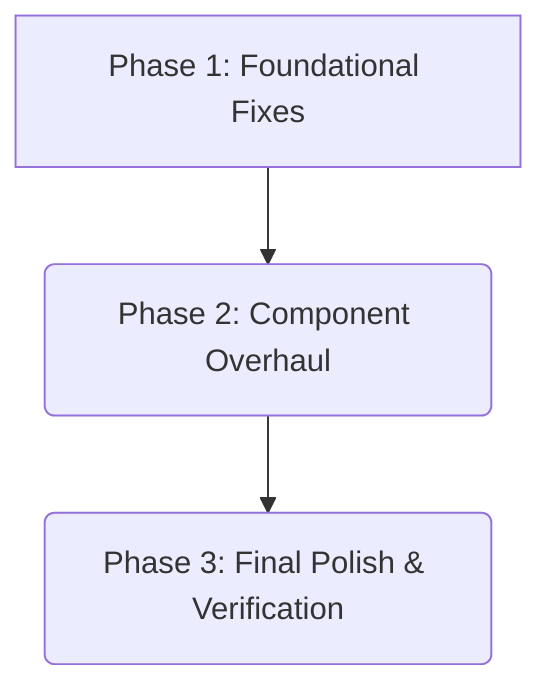

# Actionable Tasks: Chatbot UI/UX Overhaul

**Feature**: [Chatbot UI/UX Overhaul](spec.md)
**Last Updated**: 2026-01-01

## Implementation Strategy

The implementation will be a phased, full rewrite of the chatbot frontend to fix all bugs and meet the mandatory quality standards. The order is critical:
1.  **Phase 1 (Foundational Fixes)**: Address the root cause of the rendering and layout bugs. This is a prerequisite for any visual changes.
2.  **Phase 2 (Component Overhaul)**: Rewrite every UI component from scratch to implement the new professional design and stable state logic.
3.  **Phase 3 (Final Polish & Verification)**: Apply final styling touches and perform a verification check to ensure all requirements are met.

---

## Phase 1: Foundational Fixes

**Goal**: Fix the critical import bug and incorrect component mounting strategy to ensure the chatbot can render reliably and float correctly.

-   [ ] T001 Rewrite `src/clientModules/chatbot.js` to correctly import `ChatContainer` and mount it into a dedicated `div` appended to `document.body`.

---

## Phase 2: Component & UI/UX Overhaul

**Goal**: Implement the new professional, modern UI and stabilize all state management and component interactions. This corresponds to User Stories 1 & 2 from the specification.

### User Story 1 & 2: Floating UI & Selected Text

-   [ ] T002 Rewrite the root component `src/components/Chatbot/ChatContainer.js` to manage all state (`isOpen`, `messages`, `selectedText`, etc.) and implement the core floating layout and toggle button logic.
-   [ ] T003 Rewrite the main chat panel `src/components/Chatbot/ChatWindow.js` with the new professional design, including a proper header and layout for its children.
-   [ ] T004 [P] Rewrite the message list component `src/components/Chatbot/MessageList.js` to support auto-scrolling and the new message design.
-   [ ] T005 [P] Rewrite the individual message component `src/components/Chatbot/Message.js` with distinct, modern styling for user and agent bubbles.
-   [ ] T006 [P] Rewrite the input component `src/components/Chatbot/ChatInput.js` with a polished input field, send button, and loading state.
-   [ ] T007 [P] Rewrite the `src/components/Chatbot/FloatingActionButton.js` to match the new design aesthetic for the "Ask about selection" button.

---

## Phase 3: Final Polish & Verification

**Goal**: Apply final styling touches and verify that all functional and UX requirements from the specification have been met.

-   [ ] T008 Add smooth open/close animations to the chat window in `src/components/Chatbot/ChatContainer.js`.
-   [ ] T009 Polish all component styles in `src/components/Chatbot/` to ensure consistent spacing, typography, and colors.
-   [ ] T010 Perform a final verification of all functional requirements as detailed in the `spec.md` (toggle works, floats correctly, no errors, etc.).

---

## Dependency Graph

-   **Phase 1** is the mandatory first step and blocks all other work.
-   **Phase 2** tasks can be done in parallel after Phase 1 is complete, as they are all part of the same UI rewrite effort.
-   **Phase 3** is the final step after all components have been rewritten.

## Parallel Execution Examples

-   **Within Phase 2**: After `ChatContainer.js` (T002) has its new structure defined, the child components (`T004`, `T005`, `T006`, `T007`) can be worked on in parallel by different engineers, as their props interface will be stable.